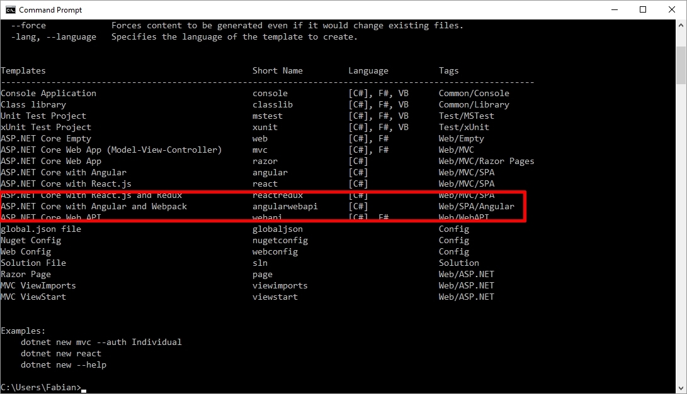

# Angular Visual Studio Webpack Starter
[](https://ci.appveyor.com/project/damienbod/angular2webpackvisualstudio)

>Template for [Webpack](https://webpack.js.org/concepts/), [Visual Studio](https://www.visualstudio.com/), [ASP.NET Core](https://docs.microsoft.com/en-us/dotnet/core/) and [Angular](https://angular.io/). Both the client and the server side of the application are implemented inside one ASP.NET Core project which makes it easier to deploy.


## Features
- Angular [AoT compilation](https://angular.io/guide/aot-compiler)
- Angular [Lazy-loading modules with the router](https://angular.io/guide/ngmodule#lazy-loading-modules-with-the-router)
- Angular [Style Guide](https://angular.io/guide/styleguide)
- Webpack [Hot Module Replacement](https://webpack.js.org/guides/hot-module-replacement/)
- Webpack [DevServer](https://webpack.js.org/configuration/dev-server/)
- Development & Production builds
- SASS, CSS
- Testing client using _Jasmine_ and _Karma_
- Testing server usign _xUnit_
- _Yarn_ & _npm 5_

## Authors


_[Fabian Gosebrink](https://twitter.com/FabianGosebrink), [Damien Bowden](https://twitter.com/damien_bod), [Roberto Simonetti](https://twitter.com/robisim74)_

Blogs:
- [damienbod.com](https://damienbod.com/2016/06/12/asp-net-core-angular2-with-webpack-and-visual-studio/)
- [offering.solutions](http://offering.solutions//blog/articles/2016/06/12/asp-net-core-angular-2-webpack-visual-studio/)

## Table of contents
* [Project structure](#1)
* [Installing](#2)
* [Running](#3)
	* [Commands](#3.1)
	* [Development](#3.2)
	* [Production](#3.3)
* [Testing](#4)
* [Dotnet Template](#5)
* [Notes](#6)
* [Links](#7)

## <a name="1"></a>Project structure
- **src**
	- **AngularWebpackVisualStudio** _ASP.NET Core Web API project_
		- **wwwroot** _Root for Angular application deployment_
		- **angularApp** _Angular application_
			- **main.ts** _Entry point for JiT compilation_
			- **main-aot.ts** _Entry point for AoT compilation_
			- **tests** _Client tests_
		- **config** _Folder for configuration files_
			- **webpack.dev.js** _webpack configuration file for development_
			- **webpack.prod.js** _webpack configuration file for production_
			- **webpack.test.js** _webpack configuration file for testing_
			- **spec.bundle.js** _Used for client testing_
		- **Controllers** _Folder for API controllers_
		- **Models** _Folder for models_
		- **Startup.cs** _Web API configuration_
		- **package.json** _Packages for Angular app_
		- **karma.conf.js** _Karma configuration for client testing_
		- **tsconfig.json** & **tsconfig-aot.json** _TypeScript & ngc compiler options_
		- **webpack.config.js** _Webpack configuration file for development & production of Angular app_
- **tests**
	- **AngularWebpackVisualStudio_Tests** _API tests_	

## <a name="2"></a>Installing
Requirements:
- At least [.NET Core 2.0.0](https://www.microsoft.com/net/download/core)
- At least _node 6.9_ and _npm 4_

#### Yarn
You can use this template also with [yarn](https://yarnpkg.com/en/docs/install).

#### Visual Studio
The installed _nodejs_ on your system needs to be used inside Visual Studio and not the _nodejs_ from Visual Studio. You need to set the path of your node before the VS node.

In Visual Studio: _Tools -> Options -> Projects and Solutions -> Web Package Management -> External Web Tools_

Move the _$(Path)_ option above the Visual Studio one.

#### NPM Task Runner
The _NPM Task Runner_ can be used to build the client application from inside Visual Studio. This task runner can be downloaded from:

https://marketplace.visualstudio.com/items?itemName=MadsKristensen.NPMTaskRunner

## <a name="3"></a>Running
The ASP.NET Core application contains both the server side API services and also hosts the Angular client application. The source code for the Angular application is implemented in the _angularApp_ folder. Webpack is then used to deploy the application, using the development build or a production build, which deploys the application to the wwwroot folder. This makes it easy to deploy the application using the standard tools from Visual Studio with the standard configurations.

### <a name="3.1"></a>Commands
The npm scripts are used to build, watch the client application as required. The scripts can be run from the command line or the _NPM Task Runner_.

The _watch-webpack-dev_ npm script automatically starts in Visual Studio because it has been added to the _package.json_:
```
"-vs-binding": { "ProjectOpened": [ "watch-webpack-dev" ] }
```

All available commands are the following:
```
"start": "concurrently \"webpack-dev-server --env=dev --hot --inline --port 8080\" \"dotnet run\" ",
"webpack-dev": "webpack --env=dev",
"webpack-production": "webpack --env=prod",
"build-dev": "npm run webpack-dev",
"build-production": "npm run webpack-production",
"watch-webpack-dev": "webpack --env=dev --watch --color",
"watch-webpack-production": "npm run build-production --watch --color",
"publish-for-iis": "npm run build-production && dotnet publish -c Release",
"test": "karma start",
"test-watch": "karma start --no-single-run",
"lint": "tslint ./angularApp"
```

### <a name="3.2"></a>Development
For the Angular app, we use _JiT compilation_.
```
npm run build-dev
```
#### Watch for development
```
npm run watch-webpack-dev
```
#### Hot Module Replacement
```
npm start
```

### <a name="3.3"></a>Production
For the Angular app, we use _AoT compilation_, tree shaking & minification.
```
npm run webpack-production
```

## <a name="4"></a>Testing
The _xUnit_ test for ASP.NET Core API is in _tests/AngularWebpackVisualStudio_Tests_ folder:
```
dotnet test
```
or from Visual Studio: _Test -> Run -> All Tests_

See this link for more details on _xUnit_ testing in ASP.NET Core: https://docs.microsoft.com/it-it/dotnet/articles/core/testing/unit-testing-with-dotnet-test

The Angular test is in _angularApp/tests_ folder. It uses _Karma_ test runner and _Jasmine_ test framework:
```
npm test
```
See this link for more details on Angular testing: https://angular.io/guide/testing

## <a name="4"></a>Dotnet Template
To install a template for this package we prepared a `template.json` to do that.

Just run `dotnet new --install <PATH>` where <PATH> is the path to the folder where the `.template.config` folder lives.

After that you should see the template when running `dotnet new` on commandline



Now you can use the temaplte with `dotnet new angularwebapi`


## <a name="6"></a>Notes
The Webpack configuration could also build all of the scss and css files to a separate _app.css_ or _app."hash".css_ which could be loaded as a single file in the distribution. Some of the vendor js and css could also be loaded directly in the html header using the _index.html_ file and not included in the Webpack build.

## <a name="7"></a>Links
- [Lazy Loading](https://github.com/damienbod/Angular2WebpackVisualStudio/tree/master/docs/LAZY_LOADING.md)
- [Hot Module Replacement](https://github.com/damienbod/Angular2WebpackVisualStudio/tree/master/docs/HMR.md)

- [Building production ready Angular apps with Visual Studio and ASP.NET Core](https://damienbod.com/2017/01/01/building-production-ready-angular-apps-with-visual-studio-and-asp-net-core/)

## License
MIT
